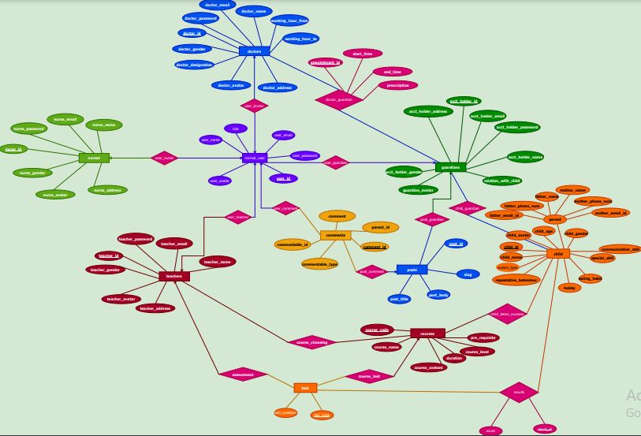

## E-Learning-Platform-for-Special-Children

### Project Objective

In this pandemic, where the students of all levels are trying to adapt to the new normal of online classes and exams, there is no such facilities available for the children with special abilities, hence we thought of making an online platform that would be helpful for these children to continue their education online with the help of their parents as regular users of our website.It was our academic DBMS project of level-3,term-1 and I had [Sazia Tabasum Mim](https://github.com/Sazia-Mim) and [Fairooz Nawar Nawme](https://github.com/anonymous-033) as my project partners.

**Click the image below to see our project video**

[](https://www.youtube.com/watch?v=PF3RLvKE8sQ)

Our project contains overall 10 database tables, Here is the ER diagram of the project




#### [SCHEMA](https://github.com/Geek-a-Byte/DBMS-PROJECT---ONLINE-LEARNING-PLATFORM-FOR-SPECIAL-CHILDREN/blob/master/schema.pdf)


#### Roles
- [x] Doctor/therapist : for determining autism type and other counselling
- [x] Teacher : for creating courses and test, assigning courses based on prerequisite test score of autistic child
- [x] Guardian : will register his autistic child and get access of courses and tests, can also view performance result graph
- [x] Nurse : caregiver for autistic child

#### PL/SQL 
- [x] procedure
- [x] trigger
- [x] sequence
- [x] cursor
- [x] exception handling 

#### CONSTRAINTS
- [x] primary key
- [x] foreign key
- [x] check
- [x] unique

#### Automated System
- [x] Appointment system

#### other features:
- [x] blog/online forum system
- [x] dynamic graph generation using result data

#### a teacher can 
- [x] create course and test
- [x] appoint courses based on test result
- [x] update result marks

#### a doctor can
- [x] view appointments list and update autism and provide prescription
- [x] set his working hours


#### a guardian can
- [x] register child
- [x] view assigned courses to his child
- [x] view result/performance graph
- [x] create post
- [x] book an appointment in his preferrable time
 

#### NECESSARY PART OF APP DIRECTORY
```
+---app
|   +---Console
|   +---Exceptions
|   +---Http
|   |   +---Controllers
|   |   |   +---Appointment
|   |   |   +---Auth
|   |   |   +---AutismTypeDefine
|   |   |   +---Childform
|   |   |   +---CourseAppoint
|   |   |   +---CreateCourseTest
|   |   |   +---GiveTest
|   |   |   +---PostComment
|   |   |   +---ResultGraph
|   |   |   +---ScoreUpdate
|   |   |   \---ViewCourses
|   |   \---Middleware
|   +---Models
|   \---Providers
+---bootstrap
|   \---cache
+---config
+---database
|   +---factories
|   +---migrations
|   \---seeders
+---er and schema
+---helpful pdfs
+---node_modules
.
.
.
.
+---public
|   +---css
|   +---image
|   +---images
|   +---includes
|   +---js
|   +---uploads
|   |   \---avatars
|   \---vendor
+---resources
|   +---css
|   +---js
|   +---lang
|   |   +---bn
|   |   \---en
|   +---sass
|   \---views
|       +---auth
|       |   +---doctor
|       |   +---guardian
|       |   +---nurse
|       |   +---passwords
|       |   \---teacher
|       +---layouts
|       \---post
+---routes
+---sql
|   \---sazia sql
+---storage
|   +---app
|   |   +---images
|   |   \---public


```


